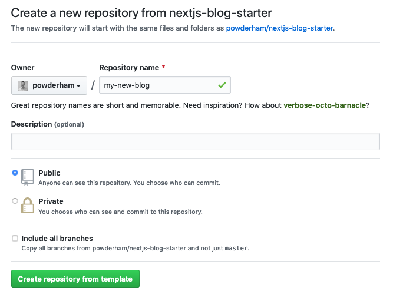
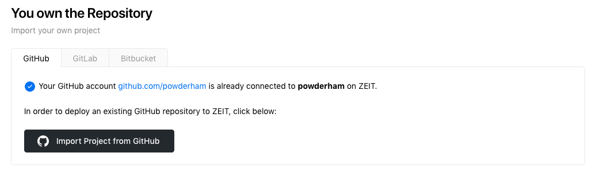
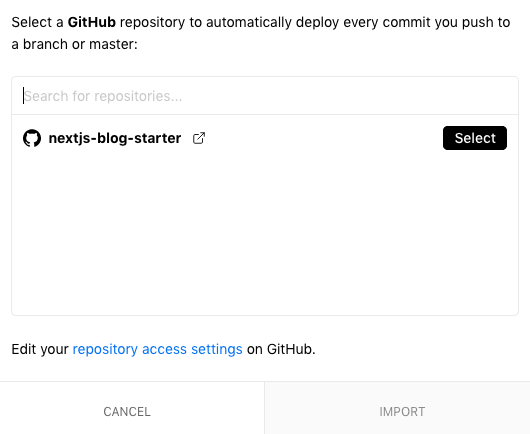
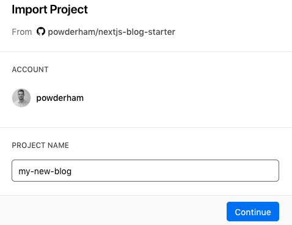
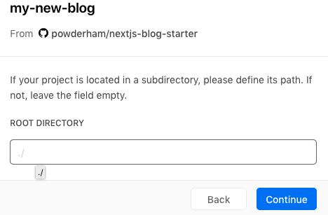
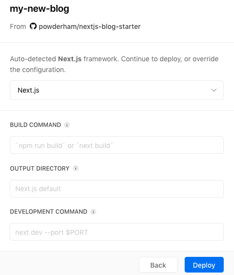
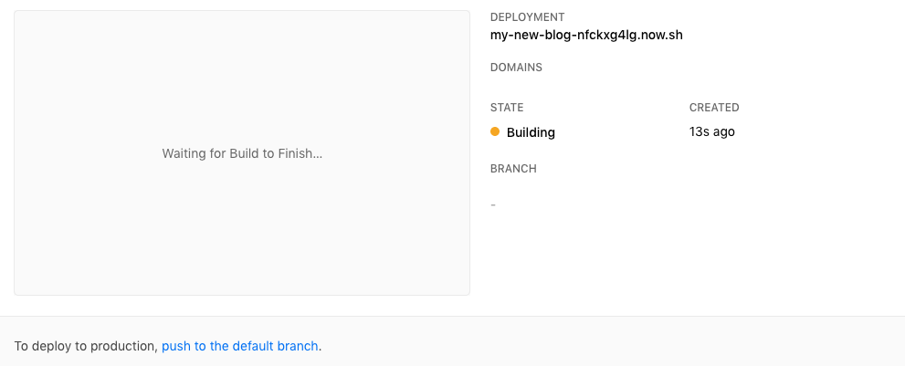
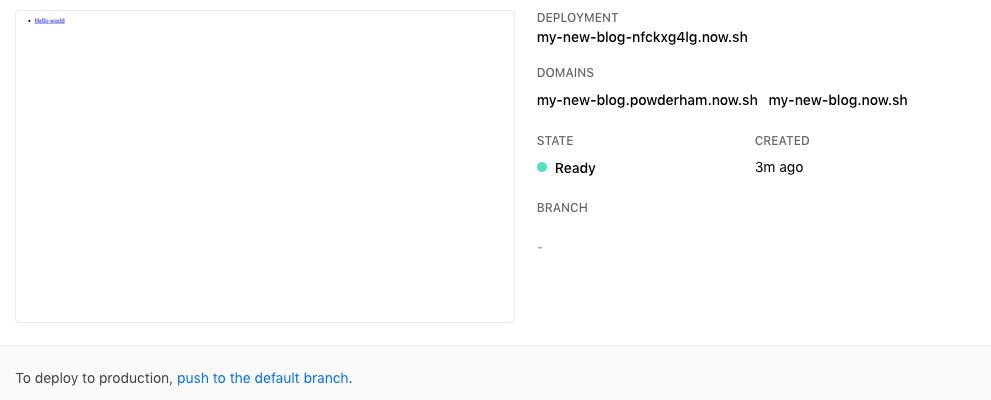

#### Intro

I recently helped a friend of mine create a live blog using my [nextjs blog starter](https://github.com/powderham/nextjs-blog-starter). The process took 5 minutes so I thought I would write a brief guide.

You will need:

- A [github](https://github.com) account
- A [zeit](https://zeit.co) account

#### Step 1: Use the template

[Create a repository](https://github.com/powderham/nextjs-blog-starter/generate) from the template.

#### Step 2: Import your new repository on zeit

Go to [https://zeit.co/import/git](https://zeit.co/import/git) and import your project

Select your repository

Import your project and give it a name

The project is not in a sub-directory so leave blank

Zeit will auto detect your nextjs project so press deploy

#### Step 3: ...?

Wait for your build

#### Step 4: Profit

Your blog is now live, and you can check it out at the [given link](my-new-blog.powderham.now.sh)

Any new commits to master will now be automatically deployed, and any markdown folder in `/src/posts` will be statically generated and served via zeit.
